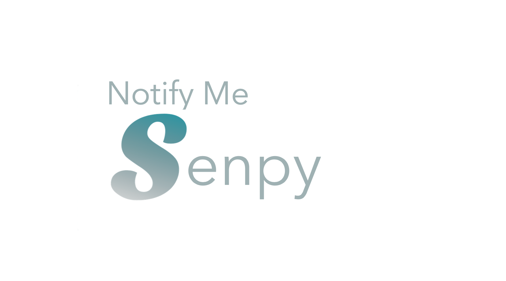
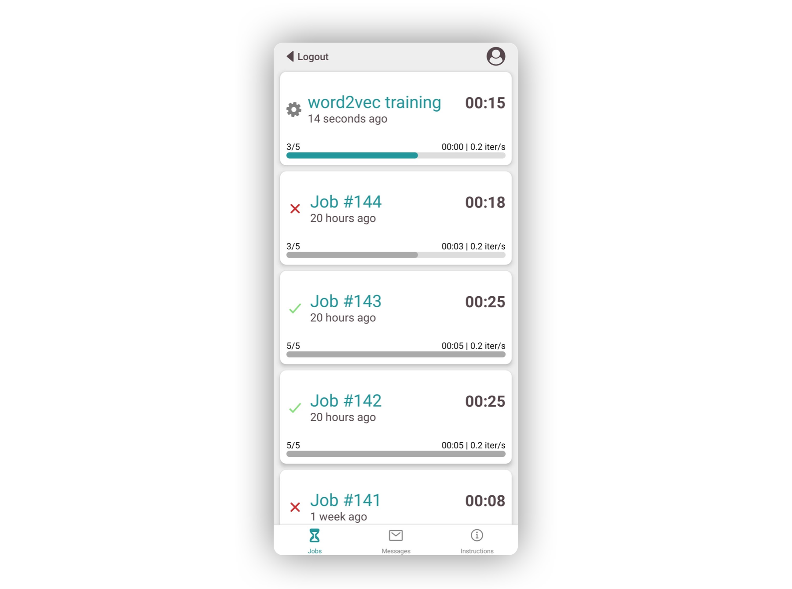
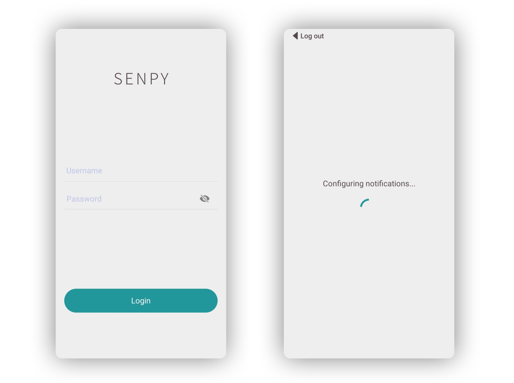

 

## What is it?

*Notify Me SenPy* is a tool that let's you track your Python scripts' execution and receive a notification whenever the execution reaches certain points.

It is composed of a Python package and a mobile app. The package is used in your Python script to specify which job you want to track and at which points you want to receive notifications. The application is where you can check on your job progress and see the notification history.

<p float="center">

</p>

## Usage

You can send notifications from a script to your app using `notify_me`
```python
from senpy import notify_me

notify_me("Great job!")
```

You can track your jobs using the `ntm` python `with statement`:

```python
from senpy import ntm
from time import sleep 

with ntm(range(10)) as iterator:
    for i, item in enumerate(iterator):
        sleep(5)
``` 

### Use cases : 


#### 1 - Use `notify-me` and `ntm` at the same time:

```python
from senpy import notify_me, ntm
from time import sleep

IDLE_TIME = 3 * 60 * 1000 ## 3 minutes

def very_long_computation():
    time.sleep(IDLE_TIME)
    
    
with ntm(range(0, 100)) as values:
    for value in values:
        if(value % 10 == 0):
            notify_me(f"We are at iteration {value}")


notify_me("The computation is done !")
```


#### 2 - Hyperparameter fine-tuning :

Here we try to find the appropriate value for the number of clusters. This computation can be time-consuming and cumbersome to track manually.

```python
from sklearn.cluster import KMeans
from senpy import notify_me, ntm


# random dataset generated by sklearn
X = make_blobs(n_samples=300_000, n_features=100)[0]

inertias = []

with ntm(range(1, 100, 10)) as nb_clusters:
    # as I use ntm, SenPy keeps me updated on job screen
    for i in nb_clusters:
        km = KMeans(n_clusters=i, init='random')
        km.fit(X)
        inertia.append(km.intertia_)


# at the end of the computation I get notified by SenPy
notify_me(f"KMeans fitted, inertia went from {inertias[0]} to , {inertias[-1]}")
```


## Installation
### 1. Package
First install the *Notify Me SenPy* Python package
```bash
pip install notify-me-senpy
```

Create an account from the command line
```bash
senpy register
>>> ? Username: your_username
>>> ? Password: *********
>>> ? Password confirmation: *********
```

The existing commands are
```bash
senpy {register|login|logout|change_password|delete_account}
```
You are done with the package setup! 🎉

### 2. App

Download the *Notify Me SenPy* app from the store.

Once the app installed, open the app and wait until the configuration is done. You should receive a notification confirming that the configuration has been successfully completed. Otherwise, check your connection, try again or try re-installing the app.

Once done, you simply have to log into your account in the app to complete the installation.
<p float="center">

</p>


## To contribute

### Architecture 

The directory ```senpy_package``` is, at this time, built as follows :
```bash
├───senpy # Folder containing the source code
    ├───account_manager.py # authentication system
    ├───cli.py # cli utility functions
    ├───jobs.py # ntm with statement source code
    ├───notifications.py # notify_me source code
    ├───request_utils.py # HTTP methods
    └───user_token.py # Auth-token-related functions
├───tests # Unittests for each function
    ├───notify_me.py 
    └───ntm.py
└───setup.py # Package configuration file
```


### Development

To get started, you can create a virtual environnement and install the packages listed in `requirements.txt`:
```
git clone https://github.com/magantoine/senpy-package
pip install virtualenv
virtualenv venv
source venv/bin/activate
cd senpy-package
pip install -r requirements.txt
```

Run the following command from the top folder:
```
pip install --editable .
```
You only need to run this command once. What it does is that it installs a package, called `senpy`, whose implementation is in the current folder (and not in the usual `site-packages`), so every subsequent code modifications while be taken into account.
You can directly go to the Usage section.


