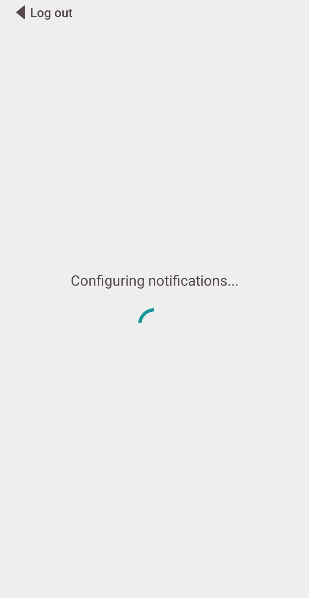
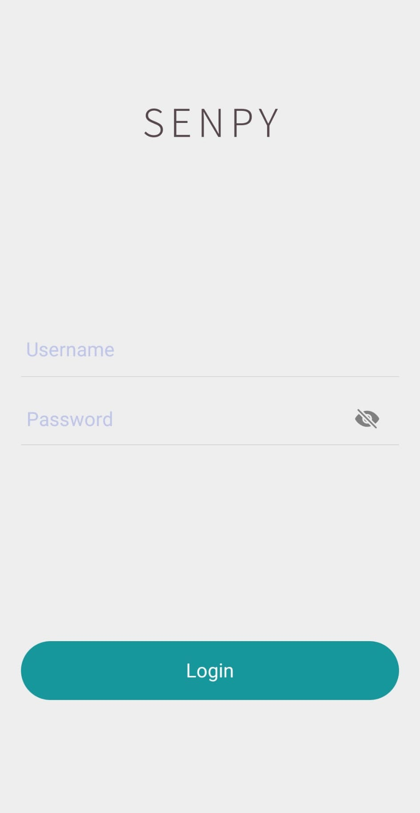

# Notify Me Senpy

## Installation
### 1. Package
First install the Notify Me Senpy pip package
```
pip install notify-me-senpy
```

Create an account from the command line
```
senpy register
>>> ? Username: your_username
>>> ? Password: *********
>>> ? Password confirmation: *********
```

The existing commands are
```
senpy {register|login|logout|change_password|delete_account}
```
You are done with the package setup! 🎉

### 2. App

Download the Notify Me Senpy app from the store.

Once the app installed, open the app and wait until the configuration is done. You should receive a notification confirming that the configuration has been successfully completed. Otherwise, check your connection, try again or try re-installing the app.

Once done, you simply have to log into your account in the app to complete the installation.
<p float="center">


</p>
<br/><br/><br/>

## Usage

You can send notifications from a script to your app using `notify_me`
```python
from senpy import notify_me

notify_me("Great job")
```

You can track your jobs using the `ntm` `with` statement:

```python
from senpy import ntm
from time import sleep 

with ntm(range(10)) as iterator:
        for i, item in enumerate(iterator):
            sleep(5)
``` 


## To contribute

### Architecture 

The directory ```senpy_package``` is, for now built as follows :
```
├───senpy # Folder containing the source code
    ├───manage.py # Django management script
    ├───senpy # Project setup
    └───
├───tests
    ├───manage.py # Django management script
    ├───senpy # Project setup
    └───
└───setup.py # Package configuration file
```


### Development

To get started, you can create a virtual environnement and install the packages listed in `requirements.txt`:
```
git clone https://github.com/magantoine/senpy-package
pip install virtualenv
virtualenv venv
source venv/bin/activate
cd senpy-package
pip install -r requirements.txt
```

Run the following command from the top folder:
```
pip install --editable .
```
You only need to run this command once. What it does is that it installs a package, called `senpy`, whose implementation is in the current folder (and not in the usual `site-packages`), so every subsequent code modifications while be taken into account.
You can directly go to the Usage section.


