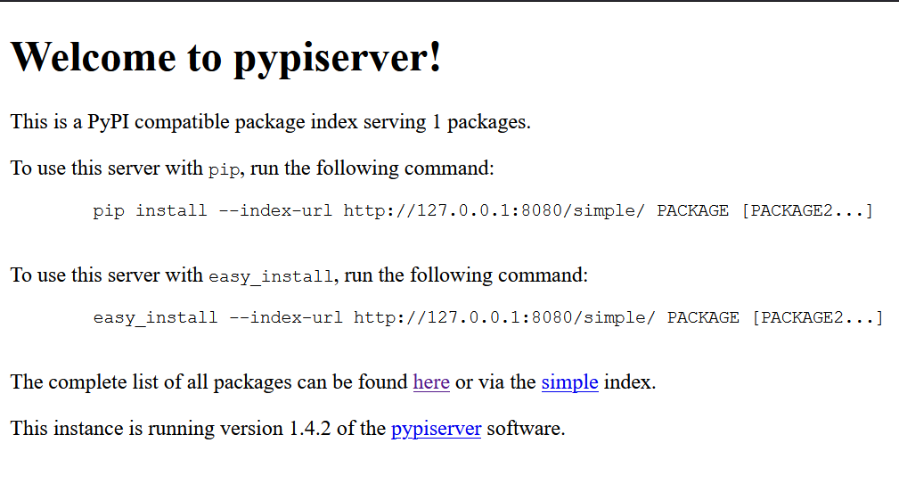

# Senpy package


## How to use as private package :

We want to be able to use the scripts as a **PyPi** package but we don't want to publish it right away. So we can run a private PyPi package


### 1. The directory 

The directory ```package_senpy``` is, for now built as follows :
```
> NotifyMeSenpy /
    > __init__.py
    > test.py
> gitignore
> LICENSE.txt
> package
> README.md
> setup.cfg
> setup.py
```


### 2. Setting up the pypi server

Running a personnal pypi server requires a the pypi packages ```virtualenv``` and ```pypiserver``` that you can install the following way :

```shell
pip install virtualenv
pip install pypiserver
```

In the root directory create the folder that will hold the package's release and in which you will put the files running the server :

```shell
mkdir ../package
```

Once you've create the folder you can instantiate the virtual environment the following way :

```shell
cd ../package
virtualenv venv
source venv/Scripts/activate
```

For Windows users you can :
    - use WSL
    - simply run the script as ``` ./activate.bat ```


### 3. Release 

The pypiserver is now ready to locally host any released code you might give him. It can nevertheless only hold deliverables (just as Pypi would). To create a release, you can use to setup.py code the following way :

```shell
python setup.py sdist
```

You should now have the following directory ```package_senpy``` :
```
> dist /
    > notify-me-senpy-0.1.tar.gz
> NotifyMeSenpy /
    > __init__.py
    > test.py
> gitignore
> LICENSE.txt
> package
> README.md
> setup.cfg
> setup.py
```

The server is now ready to run the released version of the code.

To change the released version proceed as follows :

1 - go on the github repo (https://github.com/magantoine/senpy-package)

2 - clic on ```Releases```

3 - clic ```Draft a new release``` and create a new one incrementing the release tag

4 - right clic on ```source code (tar.gz)``` on the new release you just created

5 - put the link in ```setup.py``` at ```download_url```

### 4. Run the server

Now you can run the pypi server in the ```package``` directory using :

```
pypi-server -p 8080 .
```

To check everything went well you can try to loading this page on your favorite browser : http://127.0.0.1:8080/


You're supposed to get the following page :





Verify that your pypi server is indeed serving **1 package**.


### 5. Utilisation

Now in any python screen you like you can do 

```python
import NotifyMeSenpy
``` 

and indeed get the package's function


